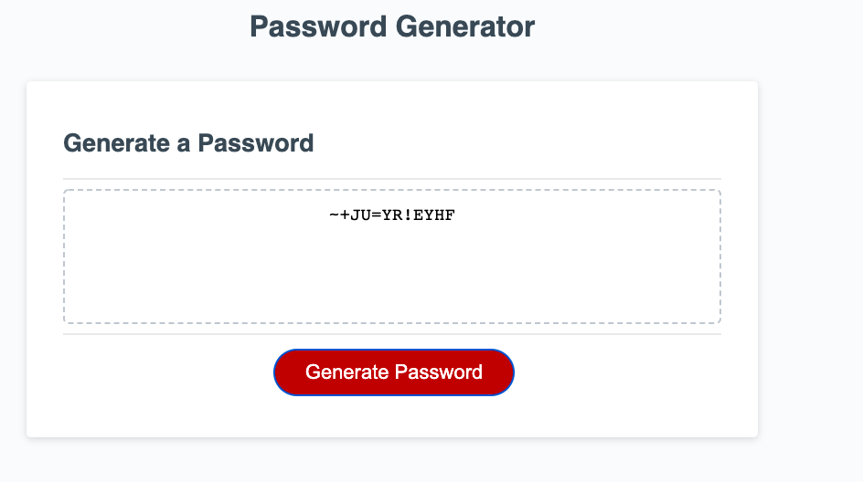

# Password Generator
 
## Description

This application generates a password on every button click. This application would be useful for anyone that is looking to create a random passwords.

## How to use the project

When the user loads the application, here is prompted window comes out with a button to generate the password. Once the user entered the password length between 8 and 128 characters, they can choose from either lowercase or uppercase letters, special characters, or numbers to help build their random password generator. To choose each input, click "ok" to signal yes or click "cancel" for no.

Once all of the elements are responded to, a random password is generated in the text box matching the criteria that the user requested.

## Live Link

https://jean424.github.io/generatePassword/

